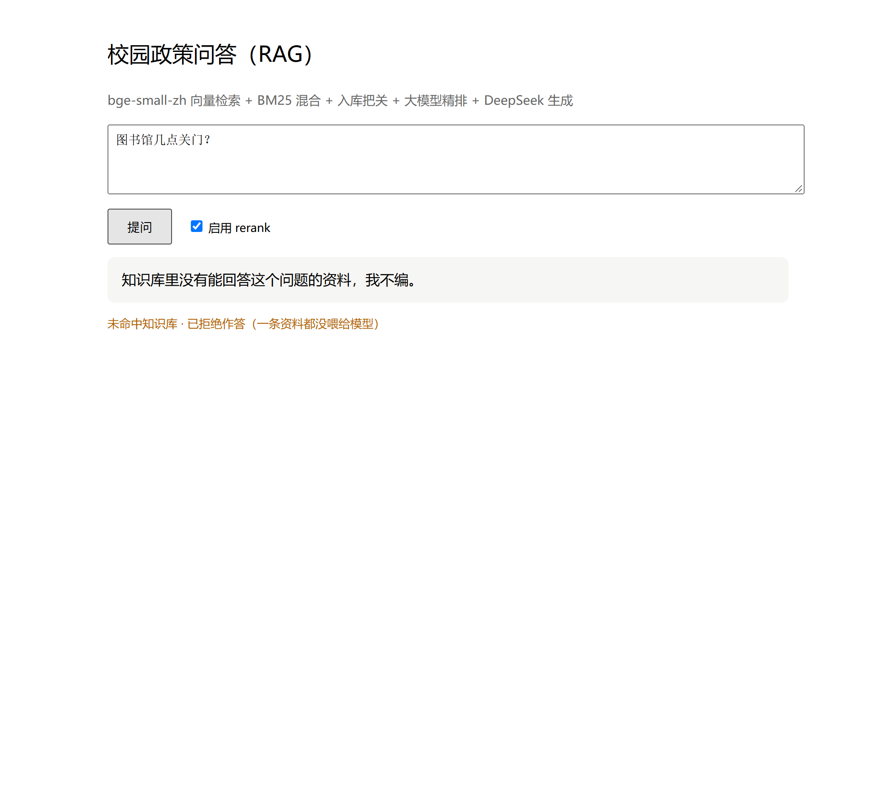
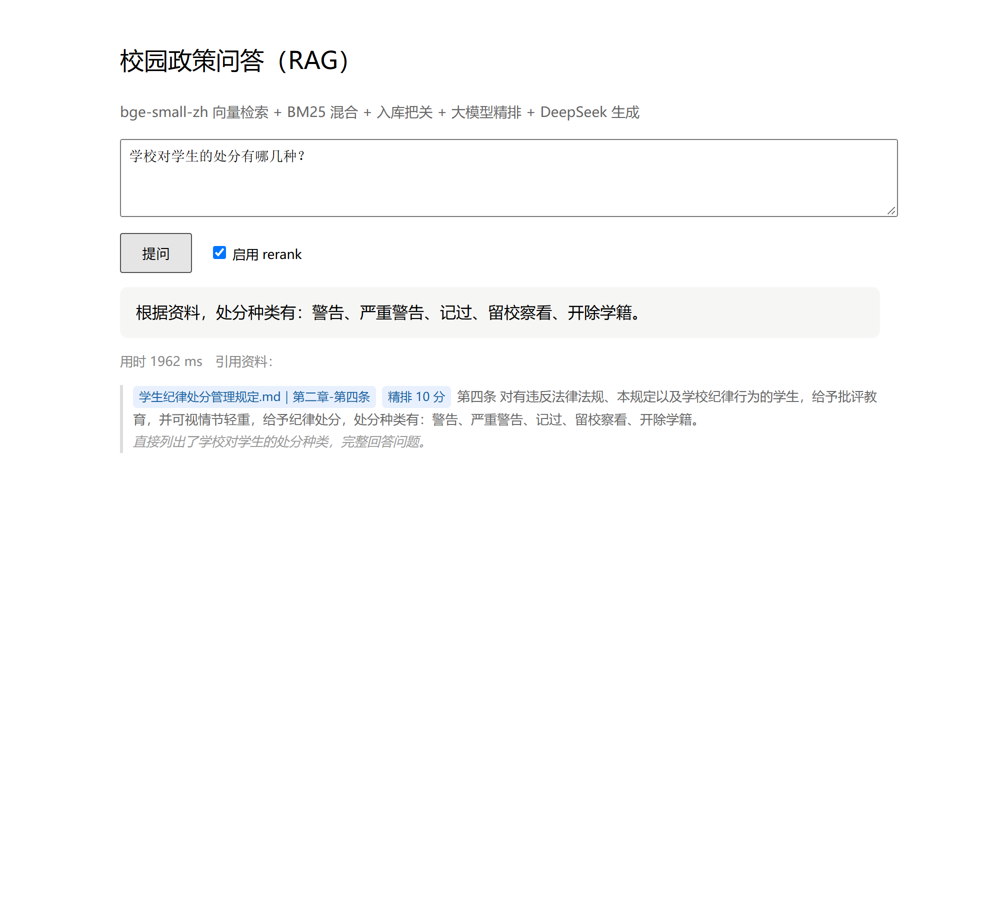
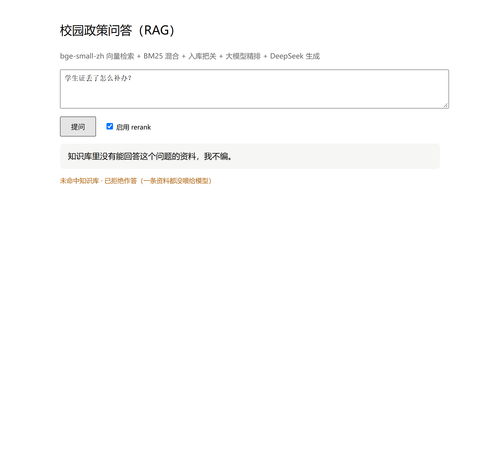
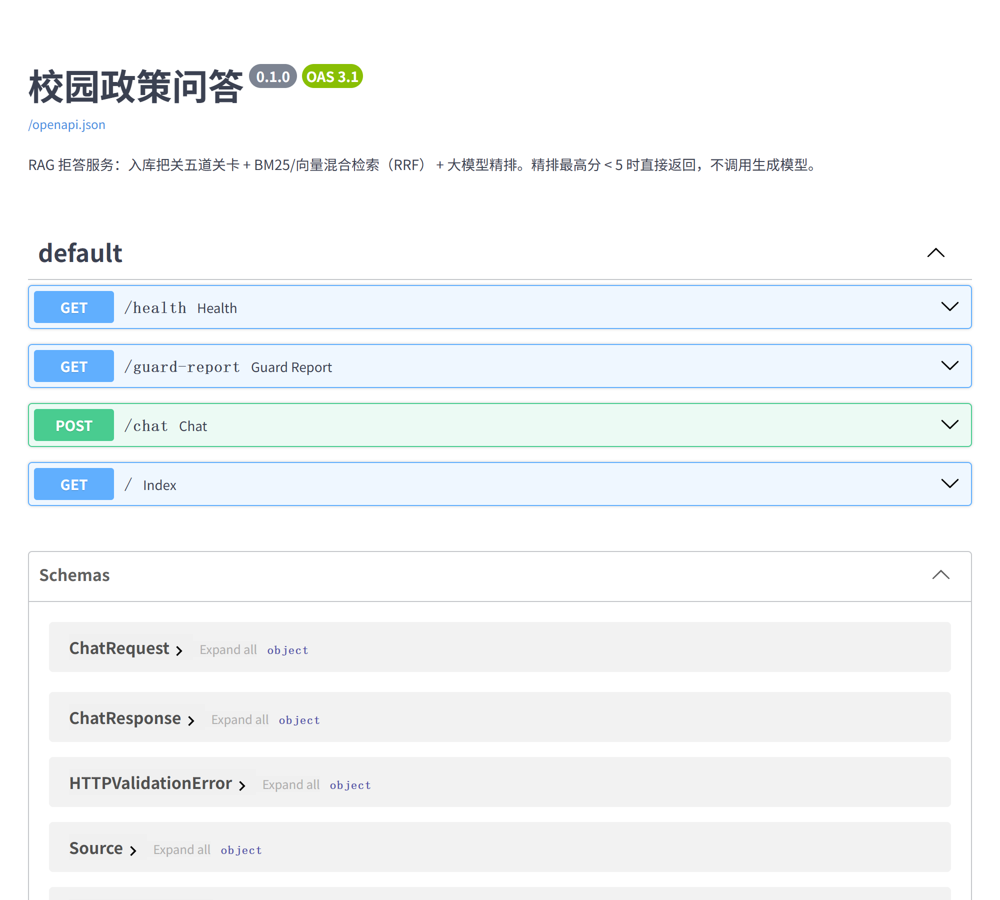

# 校园政策问答：一个不会瞎说的 RAG 服务

>仓库名是早期版本留下的（`rag-customer-service`），那时做的是客服知识库。
> 项目后来换成了校园政策场景，**仓库名没跟着改**——内容以本README 为准。

大多数 RAG demo 的目标是"答得出来"，这个项目的目标是 **"答不出来的时候敢说不知道"**。
完整链路（入库把关 → 检索 → 精排 → HTTP 服务）都跑通了，重点在两件事：
**垃圾数据不让它进库**、**库里没有就不许它编**。

## 同一套服务，两种结果

下面是**一次真实调用返回的原文**，不是示意图。

**① 问不到 → 直接拒答**（实测 2.1 秒；拒答路径不调生成模型，比走完整回答快）

```json
{"answer": "知识库里没有能回答这个问题的资料，我不编。",
 "sources": [], "knowledge_hit": false, "took_ms": 2142}
```



> "我不编"这三个字是**代码里写死的常量**（`service.py:585` / `604`），不是模型自己说的。
> 正因为它是常量，才**不可能**被模型的临场发挥带偏成一段"听起来很对"的编造。

**② 问得到 → 带出处作答**（实测 2.0 秒）

```http
POST /chat  {"question": "学校对学生的处分有哪几种？", "use_rerank": true}
```

```json
{
  "answer": "根据资料，处分种类有：警告、严重警告、记过、留校察看、开除学籍。",
  "sources": [
    {
      "doc": "学生纪律处分管理规定.md｜第二章-第四条",
      "text": "第四条 对有违反法律法规、本规定以及学校纪律行为的学生，给予批评教育，并可视情节轻重，给予纪律处分，处分种类有：警告、严重警告、记过、留校察看、开除学籍。",
      "score": 0.74,
      "rerank_score": 10,
      "reason": "直接列出了学校对学生的处分种类，完整回答问题。"
    }
  ],
  "rerank_used": true,
  "knowledge_hit": true,
  "took_ms": 1968
}
```



> 注意页面上那个 **「精排 10 分」标签和它下面的一句理由** —— 这不是装饰：
> `rerank_score` 是 0–10 的打分，`reason` 是打分模型自己写的判断依据。
> 没有这一层，唯一的拒答依据就是向量余弦相似度，而它把下面那道题判成了 0.60（越过 0.55）：

**③ 边界题：向量路放行、精排拦住**（这条最能说明 gate 不是装饰）

```json
{"answer": "知识库里没有能回答这个问题的资料，我不编。",
 "sources": [], "knowledge_hit": false, "took_ms": 993}
```



> 这道题是**故意挑的失败类别**：「学生证丢了怎么补办」在语义上离校规条款很近，
> 纯向量路的分数是 **0.6049，越过了 0.55 阈值**——也就是说**关掉精排它就会被放行**，
> 然后模型会拿着一条不相关的校规去编答案。精排层把它按住在 5 分以下。
> 这也是〈评测集〉一节里「关掉精排 → 拒答准确率 6/6 掉到 5/6」里掉的那一条。

> **① 才是这个项目的重点。** 多数 RAG demo 在这一步会照着编一段"听起来很对"的答案 ——
> 因为它们的写法是"低分也把第一条硬塞进 prompt，寄希望于提示词让模型拒答"，而提示词一定会漏。
> 这里的做法是**最高分不到 5 分就直接返回，压根不调用生成模型作答**。
> （说准确点：精排那一步模型确实读了候选资料，但它只负责打分；分不够就到此为止，
> 不给它"照着编"的机会。）

**整体成绩**（实测值，不是测试的上界）：

| 项目 | 结果 |
|---|---|
| 15 道应答题 Recall@5 | **14 / 15**（漏的是口语化表述那条 q12，后面〈评测集〉一节有专门分析） |
| 5 道拒答题 · 在线层（rerank） | 待跑（需 API key） |
| 5 道拒答题 · 离线层（向量分 0.55） | **3 / 5** —— ⚠️ 新语料入库后掉了两道，见〈评测集〉的「拒答边界随语料变化」一节 |
| 入库把关 | 放行 **263** 条、拦下 **23** 条（6 道关卡） |
| 测试 | **53 条通过 + 4 条留红**；另有**手工变异检查**——故意改坏关键逻辑，测试立刻红（下面〈变异检查〉一节有清单和命令） |

> ★ 2026-10-10：语料从 68 块加到 263 块之后，**「0.55 这个阈值」和「五道关卡够用」都被推翻了**。
> 那 4 条留红的测试**每一条的 docstring 里都写清了为什么红、怎么解决、为什么现在不解决** ——
> 留红是为了让欠账挂在明面上，不是忘了改。

**技术栈**：Python · FastAPI · `bge-small-zh-v1.5` embedding · BM25 + 向量**混合检索**（RRF 融合）· DeepSeek 精排与生成 · 内存索引（不依赖外部向量库，一条命令起服务）

**语料**：学校官网「学生资料栏目」公开的 **9 份现行制度**（纪律处分、请假销假、资助工作、奖励办法、
国家奖助学金、综合素质测评、专项补助、勤工助学、集体外出活动安全、应征入伍），
清洗成 **263 条**条款块；另有 **15 条**网页抓取时真实产生的脏数据（导航菜单残留）放在 `docs/inbox/` 待审核区。
想加文档，往 `docs/` 扔一个 `.md` 就行，不用改代码。
另有 7 份学院内部材料（含带学生姓名的公示表）**永远不会进这个公开仓库** —— 宁可语料少，也不要数字假。

---

## 30 秒跑起来

```bash
# 0. 建议先建个虚拟环境再装依赖（全局装容易和别的项目打架）
python -m venv .venv && .venv/Scripts/activate    # Mac/Linux: source .venv/bin/activate

# 1. 装依赖
pip install -r requirements.txt

# 2. 配密钥：复制模板成 .env，再填上真实值
copy .env.example .env          # Mac/Linux 用: cp .env.example .env
# 然后打开 .env，把 DEEPSEEK_API_KEY 换成你的真实 key。
# .env 已被 .gitignore 挡住，不会进 git；.env.example 里没有真密钥，可以提交。
# （为什么不用 setx？setx 是 Windows 专有命令，服务器上不存在，
#   而且设完要重开终端；.env 跟着项目走，clone 下来复制一份就能跑。）

# 3. 跑自检（不起服务，验证入库把关 + 拒答短路对不对）
python -m pytest tests/ -v          # 期望：57 passed
# ★ 这一步【不需要 DEEPSEEK_API_KEY】：三个会碰模型的测试文件都注入了假模型
#   （tests/conftest.py），一条都不真调。想顺便看"留了谁 / 拦了谁"：加 -s

# 4. 起服务
python service.py
```

启动大概 3~4 秒（加载 embedding 模型 + 建库，只在启动时做一次）。
终端最后出现这两行就说明起来了：

```
就绪：68 块入库，拦下 15 块，耗时 3.6 秒
Uvicorn running on http://127.0.0.1:8000 (Press CTRL+C to quit)
```

打开 <http://127.0.0.1:8000> 是聊天页面，<http://127.0.0.1:8000/docs> 是自动生成的接口文档，
<http://127.0.0.1:8000/health> 返回 `{"status":"ok","chunks":68,"rejected":15}`。



**按 `Ctrl+C` 停止**（不是关掉窗口就行——关窗口也能停，但 Ctrl+C 更干净）。

> 只验证"起没起来"不想开浏览器的话，另开一个终端敲：
> `curl http://127.0.0.1:8000/health`
>
> 常见问题：
> - **没配 `DEEPSEEK_API_KEY` 也能启动**，但提问会返回"已找到相关资料，但模型调用失败"
>   （检索/把关都不需要 key，只有最后一步生成答案需要）。
> - **端口 8000 被占用**：改 `service.py` 末尾的 `port=8000`，或先找到占用进程停掉。
> - **第一次跑要下载 embedding 模型**（约 100MB），之后走缓存；国内建议带上
>   `HF_ENDPOINT=https://hf-mirror.com`（源码里已用 `setdefault` 设成镜像，设环境变量可覆盖）。

---

## 它长什么样

```
              ┌────────────── 启动时做一次 ──────────────┐
 知识库文档 ──→  入库把关（5 道关卡）→ embedding → 向量库 + BM25 索引
              └──────────────────────────────────────────┘
                                              │
 用户提问 ──→ 向量检索 ─┐
              BM25   ─┴─→ RRF 融合 → 粗捞 top-5 → 大模型精排 → 取 top-3
                                                      │
                                              ┌───────┴────────┐
                                         最高分 < 5        最高分 ≥ 5
                                              │                │
                                      直接拒答（不再生成）  看着资料作答 + 引用出处
```

**两道防线**：

| 防线 | 建在哪 | 拦什么 |
|---|---|---|
| 入库把关 | 数据**进来之前** | 脏数据（重复、隐私、旧版本）根本进不了库 |
| 拒答硬短路 | 答案**出去之前** | 库里没有相关资料时，不再往下走生成（精排只打分，分不够就返回） |

**为什么不依赖外部向量库**（一个取舍，不是偷懒）：

索引就是**进程内存里的一个 numpy 数组 + 一个 BM25 索引**，启动时建一次。
实测（68 条）：embedding **1.2 秒**、BM25 建索引 **0.015 秒** —— 建索引本身并不慢，
真正的问题是**每次启动都要重算一遍**。代价是四条，都是真的：

| 代价 | 现状 |
|---|---|
| 每次启动全量重算 | 进程一退出索引就没了，重启要重算那 1.2 秒 |
| 索引只在单个进程内 | 起两个实例就各有一份，互相看不见 |
| 多实例之间不一致 | 一个实例加了文档，另一个不知道 |
| 按 metadata 过滤要自己写 | 没有现成的过滤语法，只能自己扫一遍 |

在"68 条 + 单人使用"这个量级上，这些代价不痛；而引一套 Milvus / Chroma 带来的部署与运维成本，
比它解决的问题还大 —— 所以这一步不做。
⚠️ 什么量级会开始痛，**我没有实测过，这是判断不是结论**。

---

## 拒答是怎么做到"硬"的

关键不在提示词写得多好，而在**低分时压根不调用生成模型**：

```python
if not ranked or ranked[0][2] < 5:        # 连最高分的候选都不到 5 分
    return ChatResponse(answer="知识库里没有能回答这个问题的资料，我不编。",
                        sources=[], knowledge_hit=False)
```

对比一下两种写法的差别：

| 写法 | 结果 |
|---|---|
| 硬塞一条低分资料进去，指望提示词让模型拒答 | 提示词会漏，**喂了假资料模型就会照着编** |
| 一条都不喂，直接返回（本项目） | 物理上不可能产生幻觉 —— 没东西可编 |

**关掉 rerank，拒答不会消失，但防线会退化。** 网页上那个「启用 rerank」复选框不是无所谓的对比开关：
关掉它改用向量分判断（余弦相似度，0~1），拒答准确率从 **6/6 掉到 5/6**（2026-10-08 实测）——
漏掉的那一道是 q20「学生证丢了怎么补办？」，它的向量分 0.6049，比 4 道清晰拒答里最高的那道（0.5250）还高。

```python
# 该答的（7 题）向量分 0.6541 ~ 0.8425   ← 最低 0.6541
# 该拒的（5 题）向量分 0.2619 ~ 0.4373   ← 最高 0.4373
# 两边中间空着 0.22 的间隔，取中间值 0.55，离两边都留了余量
VEC_REJECT_THRESHOLD = 0.55
```

> 这里以前写的是"关掉 rerank 没分数可判断，只能照常生成" ——
> 那等于**取消勾选一下，整个拒答机制就没了**，而且 `knowledge_hit` 还是 `true`，
> 调用方还以为命中了。现在两条路都有拒答，`tests/` 里有断言专门盯着这个。

接口响应里有 `knowledge_hit` 字段，调用方能明确区分「答错了」和「拒绝作答」。
实测：命中时约 2.8 秒，拒答时约 1.3 秒（省掉了生成那一次调用）。

---

## 代码是怎么长出来的（`experiments/` 里保留了每一步）

| 文件 | 这一步解决什么 | 关键收获 |
|---|---|---|
| `experiments/step1_real_llm_graph.py` | 把真实大模型接进 LangGraph 图 | 模型调用是有延迟和失败的外部依赖，不是函数 |
| `experiments/step2_two_tools_choice.py` | 让模型自己选该调哪个工具 | `bind_tools` 返回的是**新对象**，不是原地改 |
| `experiments/step3_real_tools.py` | 真的去读文件 | 工具必须做参数校验（防路径穿越、目录白名单） |
| `experiments/step4_rag_demo.py` | 文档切块 + 向量检索 + 混合检索 | 光看字面（BM25）和光看语义（向量）都会翻车 |
| `experiments/rag_concepts_demo.py` | RAG 概念拆开演示 | recall@k 怎么算、喂假资料会怎么产生幻觉 |
| `experiments/step5_ingest_guard_demo.py` | **入库前把关** | 垃圾进 = 幻觉出，必须在入口拦 |
| `experiments/step6_fastapi_service.py` | 把整条链包成 HTTP 服务 | 从"自己能跑"到"别人能用" |
| `experiments/langgraph_basics/langgraph_toolnode_demo.py` | 工具调用的完整机制 | `ToolNode` 怎么把工具结果塞回消息流 |
| `experiments/langgraph_memory/` | 会话内记忆 / 跨会话长期记忆 | **checkpoint 和 Store 是两回事**（前者按 thread，后者全局共用） |
| `experiments/langgraph_hitl/` | Human-in-the-loop | 中断后**节点从头重跑**，所以恢复值要幂等 |
| `experiments/langgraph_persistence/` | 存档落到 PostgreSQL | 换机器进程重启存档还在；连接串该读环境变量而不是硬编码 |
| `experiments/python_syntax_for_langgraph.py` | Python 语法补漏（我写的） | 读框架代码卡住往往不是框架问题，是语法 |
| `experiments/stale_doc_robustness.py` | **混废止条款看系统会不会上当**（我写的） | 五道关卡防得住"格式坏"，防不住"内容合法但已作废" |
| `experiments/clean_corpus.py` | **PDF 转存稿 → kb 格式**（我写的） | 语料 68 → 263 块的清洗器 + 一个【三种判据全失败】的切分器留档 |
| `evalset/probe_threshold.py` | **拒答阈值扫描**（我写的） | 证明 0.55 从来没被检验过，且不存在全对阈值 |

> ★ 这一节列的文件**大部分是跟着视频课敲的**，来源在 `experiments/README.md`
> 里逐个标了。我保留它们是因为两件事值得说：**能照文档跑通一整套技术栈**，
> 以及**清楚哪些是抄的、哪些是我想的**。而 `service.py` 至今一行 LangGraph 都没有 ——
> 理由见〈技术栈〉那节末尾。
| `service.py` | 包成 HTTP 服务 + 网页 | 模型/向量库只在启动时加载一次，绝不每请求重建 |
| `tests/test_guard.py` | 把关 + 拒答的回归测试（不起服务也能跑） | 25 条 pytest 断言，改坏了立刻变红（见「变异测试」） |
| `kb/loader.py` + `docs/` | 知识库改成**从文件读**（kb/inbox 分目录） | 从"手敲 10 条常量"到"扔 md 就入库"；loader 可脱离模型独立单测 |
| `evalset/` | 20 题评测集（14 应答题 + 6 拒答题）**+ 出题包 `heldout/`（待填）** | 拿到 Recall@5 / 漏答率 / 拒答准确率三个数字，"可度量"才成立。⚠️ 这 20 题是 tuning set，`heldout/` 里那套才是独立验证集 |
| `env_compat.py` | 绕开本机 DLL 被策略拦截的坑 | 见下方"踩过的坑" |

---

## 数据层：切片（之前是整条链路最短的板）

检索再准，也只能在**已经切好的块**里挑 —— 块里没有的东西捞不出来，
块里混进的垃圾也洗不掉。所以这一节和「入库把关」同等重要。

### 修掉的两个病（2026-09-25 实测）

| 病 | 实测数据 | 为什么把关拦不住 |
|---|---|---|
| **网页页脚混进条款块** | 《纪律处分规定》第五章-第三十条 原始 495 字，**真条文仅 38 字（10%）**；<br>《请销假制度》总则-第七条 137 字，真条文仅 31 字（23%） | 这类块**长度够、不重复、无手机号身份证、元信息齐全** → 现有 5 道关**一道都拦不住**。把关真正的分界线是「长度」，不是「是不是正文」 |
| **`content[:400]` 静默截断** | 第三十条被截掉 95 字，不报错不记日志；<br>更糟的是 `test_max_chars_truncation` 用 `assert len(text) <= 50` **把"丢内容"写成了正确行为** | 同上 |

后果实测：问「招生咨询电话是多少」，**排第一的就是那块 90% 页脚的块**（0.4799）。
它没进答案只是因为分数低于 0.55 —— 是阈值救了它，不是库干净。

### 怎么修的

**① 页脚剥离（`kb/loader.py::strip_footer`）** —— 削掉尾巴，不是丢掉整块。
那两块里裹着 38 / 31 字真条文（施行日期、解释权），整块拦掉等于把真条文一起扔了。

> ★ 标记分两组，这个区分是**实测逼出来的**：
> `粤ICP备` / `版权所有` 这类强特征固然准，但它们在页脚**最后几行**——
> 而截断发生在页脚中途，实测被截后的 400 字里**根本没有这几个词**。
> 所以规则必须也认靠前的弱特征（`上一篇` / `下一篇` / `联系我们`），
> 否则在「上游已经出错」的库上会二次失效。

**② 截断不再静默** —— 保留截断（bge-small-zh 有 512 token 上限，
就算这里不截，embedding 也会把尾巴悄悄吃掉），但**必须 warning 报出丢了多少字**。

**③ 顺序不能反**：先剥页脚、再判长度。剥完之后，全库**超过 400 字的块变成 0 个** ——
截断问题自己就消失了。所以**没有**上「切多块」：修完页脚后超长块为 0，
为不存在的需求写切分器是过度设计。

### 修完的实测

```
「第五章-第三十条」剥离网页页脚 457 字（剩 37 字正文）
「总则-第七条」剥离网页页脚 106 字（剩 30 字正文）
库里还有页脚块吗: False
```

同样的三个问题，现在命中的全是真条文，不再有页脚块：

| 问题 | 改造前第一名 | 改造后第一名 |
|---|---|---|
| 招生咨询电话是多少？ | 第五章-第三十条（90% 页脚） | 第一章-第二条（真条文） |
| 学校地址在哪里？ | 总则-第七条（77% 页脚） | 总则-第一条（真条文） |

入库数字不变（放行 68 / 拦下 15），Recall@5 仍 13/14 —— 这次修的是**库的质量**，不是数量。

> ★ **这次最值钱的一条心得**：把 `assert len(text) <= 50` 换成不变量断言。
> 前者是**当前实现的快照**（实现一改就假红，且把"丢内容"当成正确行为保护起来）；
> 后者是**不变量**（不许静默、不许改正文）。写测试时先问一句：
> 我断言的是"现在的代码怎么跑"，还是"这件事必须永远成立"？

### 第二轮：又挖出三处「看着对、其实错」（2026-09-25）

这三处的共同形状是：**错的时候，日志还说得很确定** —— 这正是本项目最忌讳的一类 bug。
（线索来自一次交叉评审，但每条都自己实测确认后才落地，没有照着建议抄。）

| # | 病症 | 为什么危险（可实测的判据） | 修法 |
|---|---|---|---|
| 1 | 版本新旧按**字符串**比 | `'2026-9-5' > '2026-09-25'` 竟然是 **True** —— 字符串逐位比字符编码，比到第 6 位 `'9' > '0'` 就下结论了，它不知道"9 月 < 10 月"。于是**一个没补零的旧版会把库里真正的新版挤掉**，而拒绝理由还写成「被新版取代（2026-09-25 → 2026-9-5）」：**新旧完全说反** | 解析成 `(年, 月, 日)` **元组**再比；解析不出来的（`2026/09/25` 这种）**明确拦下并说明原因**，不许猜 —— 两个方向的错误不对称，宁可拦一条，也不能猜错把库里正确的那版挤掉 |
| 2 | 分块对格式错误**不发声** | 标题漏了 `##` 后的空格（写成 `##第三条`）→ 一个块都切不出来 → **整篇文档静默蒸发**：`docs` 里没有、`errors` 里没有、日志里也没有。另外第一个 `##` 之前的正文被 `[1:]` 切掉，同样是无声的 | 一个 `##` 都切不出来 → 判为坏文件进 `errors`（走已有通道，启动日志和 `/health` 都能看见）；第一个 `##` 前有正文 → 记一条 warning |
| 3 | 页脚剥离**句中命中**也切 | 原来是全串 `text.find(marker)`。一条 65 字的合法条款「第三十条 学生如有疑问**请联系我们**，联系电话 020-87024621。未按时办理销假且超过准假时间的，**按旷课论处**，并记入学生档案。」会被从"联系我们"处切断、**削掉 53 字**，真条文永久丢失 —— 而日志写的是「剥离网页页脚 53 字」，**把正文当页脚报了** | 只认**行首**的标记（网页页脚永远自成一行）。实测真实语料的两个切点本来就在行首，所以**剥离字数一字不差（457 / 106）**，只是把误伤面收窄了 —— 改完代码反而更短 |

**三处都配了"改前红、改后绿"的测试，并跑了变异测试**（故意把代码改坏，看测试会不会红）：
当时 4 个变异全部被抓住（后来脚本又补到 7 个，见〈变异检查〉一节）。
其中「把导语丢弃的 warning 降级成 debug」那个最关键 ——
它模拟的正是**静默清洗**，如果测试只断言"内容对不对"、不断言"有没有吭声"，它就会漏网。

> 测试 49 → **54** 条（`test_loader` 17 → 20）。入库 68 / 15、Recall@5 13/14 **全部不变**
> —— 这三处修的是**正确性**，不是召回率。

### 怎么知道它现在健康 —— 一条命令体检

修了这么多轮，得有个东西能回答"数据层现在到底怎么样"，而不是靠印象。
`scripts/measure_chunk_health.py` 就干这个（只读、秒级、**刻意不加载模型**）：

```bash
python scripts/measure_chunk_health.py
```

当前实测（2026-09-25，第三轮后）：

```
【规模】      文档 3 篇 · 块 83 条 · 解析失败 0
【长度分布】  最短 4   中位 59   p90 242   最长 353
              ≥400（会被截断）0 ✔        <15（当碎屑拦）15
【切多块判据】 判定：不动 —— 没有被截断的块
              （主判据 单块丢字 ≥100 → 当天上 ｜ 次判据 被截断块 ≥3 → 该上）
【脏数据】    页脚残留 0 ✔    空块 0 ✔    含 \r 的块 0（提示项，不计入结论）
【结构】      块内行首 ## 残留 0 ✔
【元数据】    version 非 YYYY-MM-DD 0 ✔    同文档内 clause 重名 0 ✔
【清洗账】    剥离网页页脚 2 块 563 字 · 截断丢字 0 · 丢弃 ## 前的正文 0
```

七项全过。而且**每一项都对应一个真出过事的地方**（截断 / 页脚 / 换行 / 空块 /
结构漏切 / 日期格式 / 身份键）—— 这才是这份体检的意义：它不是"随便检查了几项"，
而是**历史上每个踩过的坑都留下了一个探头**。

> ★ 判据意识：要不要上"切多块"，判据**不是**"块长到 400 了吗"，而是
> **"这一刀丢了多少字"**（`≥400 被截断 = 0` 只是它的表象）。
> 顶到 400 的块被切掉 1 个字不值得为它写切分器；丢 1 字和丢 200 字才不是一回事。
> 所以三条判据写成了一处**纯函数** `scripts/measure_chunk_health.py::grade_truncation`，
> 分四档（不动 / 记账 / 该上 / 当天上），并由 `tests/test_loader.py::test_split_trigger_grading`
> 用**合成输入**走遍每一档 —— 拿真实语料测就是"遍历空集合"，那是空断言。
> 判据只此一处；loader 里那处截断只负责**报出丢了多少字**，不重复定义判据。

**为什么还要有【清洗账】这一节**：上面那些全是**终态快照**，只问"现在的块长什么样"，
看不见"加载时动了几刀"。而剥离页脚 / 截断 / 丢导语这三刀都会**永久改内容** ——
第二轮修掉的那个 bug 正是这个形状：一条真条文被从行中切断、削掉 53 字，
剩下的文本长度正常、页脚标记也随正文一起没了，**快照全绿，一个字都不会说**。
清洗账补的就是这个盲区：它数的不是"现在长什么样"，而是"这一趟动了几刀、共几字"。

> 清洗账读的是 `record.clean_op`（loader 写进 `logging` 的 `extra`），不是解析日志文案 ——
> 解析文案就又是一处"判据和被测对象不同源"，改个措辞就静默失效。
> 两边 import 同一批常量（`CLEAN_OP_FOOTER` / `CLEAN_OP_TRUNCATE` / `CLEAN_OP_PREAMBLE`），
> 所以**改措辞不会掉，改动作才会掉** —— 这才是它该有的敏感度。

### 第三轮：体检脚本自己就是病灶（2026-09-25）

第二轮修的三处病，形状是"错的时候日志还说得很确定"。第三轮做体检时发现：
**同一颗哑弹被抄进了两个地方** —— 一处是体检脚本，一处是回归测试。

| # | 病症 | 为什么危险（可实测的判据） | 修法 |
|---|---|---|---|
| 1 | **同一颗哑弹抄了两份** | 体检脚本判"页脚残留"用的是**全串查找**（`m in text`），而 loader 第二轮已经收紧成**只认行首**。两者**方向相反**：正文里合法的一句"学生如有疑问请联系我们"在 loader 眼里是对的，在旧判据眼里却算"有残留" —— **假红**，还可能诱导出一个**错误修复**（去把 loader 改松）。`tests/test_loader.py::test_real_corpus_has_no_footer_left` 那条回归锁用的是同一个写法，装的是同一颗弹 | 两处都改成复用 loader 的 `_CHROME_RE`，**判据只留一处** |
| 2 | 空库时体检脚本**崩掉** | `min([])` 对空序列是**抛 `ValueError`**，不是返回 0（`sum([])` 才返回 0 —— 这俩常被记混）。一个专门回答"数据层健康吗"的脚本，恰好在答案是"库里什么都没有"的时候崩了 —— 而那恰恰是**最该被报出来的状态** | 加空库早退：报"★ 数据层是空的，这比任何单项指标都严重"，退出码 1 |
| 3 | 结构漏切没有探头 | 标题漏写 `##` 后的空格（`##第三条`）时那一段会**并进上一块**：块数、长度、身份键**全都正常**，但上一块里混进了下一条的标题和条文 → 检索到了会**张冠李戴**。这是第二轮 #2 的另一半：那边管"整篇蒸发"，这边管"悄悄并块" | 加【结构】探头：正文里不可能合法出现"行首 `##`"，出现即报警 |

**还顺手补了两处"名字和职责不符"**（都是这个仓库一直在修的病）：

- **体检脚本手抄的常量**（`MAX_CHARS_HINT` / `MIN_LEN_HINT`）随时可能漂移 ——
  脚本刻意不 import service（那要加载模型、十几秒），但"手抄一份"的代价就是会悄悄过期。
  修法不是让脚本去 import（那会丢掉"秒级"这个性质），而是**在测试里断言"抄的 == 真值"**：
  `test_health_script_max_chars_is_not_drifted`（真值在 kb/loader）+
  `test_health_script_min_len_is_not_drifted`（真值在 service）。漂移在 CI 当场变红，脚本依然零依赖。
- **`docs/inbox/` 里那 3 条叫「重复残留-*」的**，名字**承诺了会被关卡②（完全重复）拦**，
  实际永远不会 —— 它们只有 4 个字，关卡①（<15 字）先拦了。
  已改名成 `抓取残留-*（重复副本）`：**前缀老实写"抓取残留"，后缀交代它是重复的一份**。
  （★ 后缀不能省：直接改成 `抓取残留-内设机构` 会和上面那条同名，凭空造出一个"同文档内 clause 重名"，
  让体检报一个不存在的问题 —— 那就成了**用制造假红去修一个假红**。）

> 顺带把 `service.py` 里「docs/inbox/ 是待人工审核区」那句补全了：inbox 里其实住着
> **两类**东西 —— ① 待审副本（审完移进 `kb/`）② **明知是脏的"标本"**（永久留在 inbox，
> 唯一用途是持续证明"把关在真实数据上真的在拦"）。标本永远不会通过审核、也不该通过，
> 所以"inbox 里还有文件"**不等于审核积压**。文件、数字、测试一处都没动，只把这句说清楚。

> 测试 54 → **57** 条（`test_guard` 24 → 25、`test_loader` 20 → 22）。
> 入库 68 / 15、Recall@5 13/14、清洗账 2 块 563 字 **全部不变** ——
> 这一轮修的是**工具和文档的可信度**，一个字节的知识库内容都没改。

**顺手把「什么时候该上切多块」从一句口头约定变成了可测判据。**
原来 README 里写的是"超长块顶成 1 就该上"—— 那是**快照**，判不出轻重：丢 1 字和丢 200 字
在这句话里一样大。现在三条判据落在 `measure_chunk_health.py::grade_truncation`（纯函数，
四档：不动 / 记账 / 该上 / 当天上），主判据看**单块丢字量**（≥100），次判据看**被截断块数**
（≥3，说明粒度从"按条"变成了"按章"），反向判据钉住"<400 的块一个都不许切"。
体检脚本新增【切多块判据】小节直接报定级结果，这条测试用**合成输入**走遍四档
（真实语料 0 块被截断，拿它测就是遍历空集合 = 空断言）。变异测试同步加了第 7 条
—— 「次判据被顺手删掉」→ 3 块被截断却只说"记账"，动作线永远不触发，**必须变红**。

---

## 入库把关：六道关卡 + 版本冲突（实测结果）

286 条原始材料（263 条真实条款 + 15 条抓取残留 + 8 条被拦）→ **放行 263 条，拦下 23 条**：

| 关卡 | 拦什么 | 本项目实测拦下 |
|---|---|---|
| ① 太短碎屑 | 少于 15 字的残片 | **15 条**网页抓取残留（导航菜单 —— 真实脏数据，非构造） |
| ② 完全重复 | 归一化后 md5 相同 | **2 条**（勤工助学第二条、学生奖励第二条 —— "本办法适用于具有我校学籍的全日制在校学生"在 3 份文件里逐字相同） |
| ③ 近似重复 | 余弦相似度 > **0.96** | **1 条** |
| ④ 个人隐私 | 手机号 / 身份证 / 银行卡 | 0（公开制度不含 PII，靠脏数据夹具测） |
| ⑤ 缺少来源/日期 | `source` / `version` 为空 → 出事无法追溯 | 0（真实语料都带元信息，靠脏数据夹具测） |
| **⑤.5 废止声明** | 「同时废止」+〔文号〕+「本办法自…施行」 | **5 条**（9 份制度的附则，讲"旧版已失效"，回答不了任何现行问题） |
| 版本冲突 | 同一条款有新旧两版 | 0（公开制度只有单一版本，靠脏数据夹具测） |

> ⚠️ **上表必须这么读**：**2026-10-10 之前**真实语料只触发了第 ① 关，其余全靠 `tests/fixtures/dirty_inbox/`
> 里的构造夹具。加了 9 份学校真实制度之后，② ③ ⑤.5 **第一次被真实语料触发** ——
> 这意味着关卡覆盖度现在有两层证据：夹具证明"关卡能触发"，真实语料证明"关卡在真实输入上也会触发"。
> ④ 和版本冲突**至今仍未被真实语料触发**，只能靠夹具，不把它们算进"已被真实数据验证"。

> ★ **第 ⑤.5 关（废止声明）是真实语料逼出来的，不是预防性设计。**
> 9 份制度的最后一条都是「附则」，形如"本办法自通过之日起实施……原《XX管理办法》
> （粤交职院〔2024〕89号）**同时废止**"—— 实测 6 条，两两相似度高达 0.9560 / 0.9517 / 0.9366。
>
> **不加这一关会怎样（实测，不是推演）**：只喂 3 条进去，`_guard` 的结果是
> 「**拦 1 条留 2 条**」—— 留哪条取决于入库顺序，而且被拦那条的理由写的是「近似重复」，
> **理由完全误导**（真正原因是"它是废止声明"）。
> ⇒ 所以这一关必须走在近似重复关**之前**，让它们带着**正确的理由**被拦。
>
> ★ **判据改过一次（我犯的错）**：初版用「≤220 字」当特征之一，实测漏了 1 条——
> 那条是"废止声明 **+ 一长串拍平的附件表格**"（原文 1870 字，被 `max_chars=400` 截断后正好 400）。
> 而**长度是会被上游改写的量**，拿它当判据等于把判据绑在另一个可调参数上。
> 改法：删掉长度条件，改用**开头句「本办法自…施行」**这个语义锚点。
> 收紧前先量过：全库里同时满足三特征的块**恰好就是那 6 条，一条真条款都没被牵连**。
>
> ★ **局限必须承认**：这是**形状匹配不是语义判断**。
> 一份文件如果写"本办法自 2025 年 11 月 6 日起施行"而不提"原…同时废止"，就拦不住。
> 真正的语义判据需要 LLM 判定，成本高且拒答判据本身不可验证，不划算。
> 现在这条至少做到【已知的 6 条一条不留】，漏进来的会被 `/guard-report` 看到。

> ⚠️ **上表必须这么读**：真实语料只触发了第① 关，**其余 5 关在真实数据上拦截数全是 0**，
> 靠的是 `tests/` 里的脏数据夹具。**这不代表那 5 关没用**（它们在夹具上全部被测到、
> 且有变异点钉住），但它意味着：**"拦下 15 块"这个数字只证明了第 ① 关。**
> 面试官若追问"隐私关在真实数据上拦过什么"——诚实的答案是
> "公开制度文档里没有 PII，这关是靠构造夹具测的"，
> 而**真正在真实材料上拦到过的是那 7 份带学生姓名的公示表，它们从没进过这个仓库**（见上）。

> **⑤ 是 2026-09-23 才补上的 —— 补的理由值得记一笔**：在此之前 `_guard()` 只有前 4 关 + 版本冲突，
> docstring 却一直写着"五道关卡"，即**文档说五关、实现只有四关**：读者以为有兜底，其实没有。
> 补它不是"和教学演示对齐" —— 知识库改成从 `docs/` 目录读之后（`kb/loader.py`），
> 入库入口被主动拓宽了，此时"能追溯来源"必须由把关自己保证，不能指望 loader 或人工。
>
> ⚠️ **别高估 ⑤**：它只保证 `source` / `version` 字段**非空**，不保证来源**可信** ——
> 自己填个 `source=官网帮助中心` 照样能过。所以 `docs/inbox/` 仍是「人工审核区」，审完才移进 `docs/kb/`。
>
> ★ **"关卡从不触发"怎么保证它没坏？—— 用脏数据夹具，不用真实语料。**
> 防御性代码在干净输入上天然不触发，就像 WAF 不能用正常流量证明自己有效，得有攻击样本。
> 所以另建了一套 `tests/fixtures/dirty_inbox/`（**构造的**脏数据，一个文件对应一道关），
> 走完整链路 `load_documents → _guard`，一条断言保证六道关**每道都真的被触发**：
> `tests/test_guard.py::test_all_gates_fire_on_dirty_corpus`。
> 任何一道关被删或被改坏，那条立刻红 —— 而"放行 68 / 拦下 15"这两个数字**不会变**。
>
> ★ **修掉过一次真误伤（值得记一笔，因为我第一修修错了）**：
> 换真实语料后，《纪律处分规定》**第二十五条**（考试作弊开除情形）一度被近似重复关拦掉，
> 只因为和第二十四条余弦 0.9230 超过了当时 0.90 的阈值 —— 两条都是合法条款，误删一条。
> - **错误的第一修**：我以为"光看相似度分不开，得加身份判断（同 doc + 同 clause 才判重）"。
>   于是把 83 个块两两全量量了一遍（3403 对），才发现**"身份相同"的配对在真实语料里一对都没有**，
>   而真正该拦的那些完全相同的文本，两条 clause 名恰恰是**不一样**的 —— 加了身份判断等于放行它们。
> - **正确的解法**：全量分布显示 0.9230（不同条款，不该拦）与 0.9839（同义改写，该拦）之间
>   **是空的**，把阈值从 0.90 抬到 **0.96** 就够了，一行常量，不需要加条件。
> - **教训**：拿两三个样本下结论得出的是错的规则；先全量量分布才看出断层在哪。
>   同时补了 `test_dup_threshold_has_margin`，盯住"最像的一对非重复条款离阈值还有多远"，
>   以后语料变多把相似度顶上去，那条会先红，而不是静默删条款。

> **修过一个真 bug**：版本冲突关一开始只按「文档名」分组，
> 结果 `退款政策.md` 里【已发货】和【未发货】两条完全不同的规定被当成"同一条的新旧版"，
> 互相挤掉，库里凭空少一条规则。
> 改成按 **(文档 + 条款)** 分组后修复 —— `tests/test_guard.py` 里有对应的回归断言。

访问 `/guard-report` 能看到"哪条被拦、为什么"，不用翻日志猜。

**0.96 这个阈值不是拍脑袋定的**，是把 83 个块两两全量算了 3403 对余弦量出来的
（`scripts/measure_dup_distribution.py` + `scripts/measure_dup_threshold.py` 可复现）：

| 类别 | 实测余弦 |
|---|---|
| 该拦的（完全相同 / 一字之差 / 同义改写） | 0.9839 ~ 1.0000 |
| 该留的（同制度不同条款，最像的一对） | 0.9230 |

中间 0.92 → 0.98 **是空的**，取 0.96 两边各留 0.03 以上余量。故意**偏严**（宁可漏拦一条重复，
也别误删一条合法条款）—— 因为漏拦只是召回里多一条相似的，误删是**知识永久丢失**。

### 「写了断言」不等于「断言有用」——故意改坏给你看

验证办法叫**变异检查**（mutation testing）：故意把代码改坏，看测试会不会红。

> ⚠️ **用词边界**：这 7 个 mutant 是**手工挑的关键路径**，不是 mutmut / cosmic-ray
> 跑出来的 mutation score。没跑工具，所以也没有"mutation score = X%"这种数字可报。
> 手挑的局限是明确的：覆盖不到工具会自动生成的全部变异。
> 说"我做了 7 个变异检查"是准确的；说"我做了 mutation testing 并达到某个 score"是编的。

```bash
# ① 把 DUP_THRESHOLD 从 0.96 改成 0.99（近似重复关形同虚设）
python -m pytest tests/ -q
# → FAILED tests/test_guard.py::test_rejected_duplicate - assert False
# → FAILED tests/test_guard.py::test_near_dup_after_earlier_rejection

# ② 把 VEC_REJECT_THRESHOLD 从 0.55 改成 0.95（该答的也被拒）
python -m pytest tests/ -q
# → FAILED tests/test_eval_set.py::test_no_answerable_missed   ← 评测集门禁也响了
# → FAILED tests/test_guard.py::test_hit_returns_sources
# → FAILED tests/test_guard.py::test_vec_threshold_separates_hit_and_miss
# （条数随用例增减会变，看 FAILED 的行即可）

# ③ 把关卡5（缺少来源/日期）整段改成直通
python -m pytest tests/ -q
# → FAILED tests/test_guard.py::test_missing_source_rejected
# → FAILED tests/test_guard.py::test_guard_survives_missing_keys
#   ★ 恰好且只有这两条红 —— 说明守它的确实是这两条，没有别的测试在替它兜底

# ④ 把 guard_report() 里的 _mask_pii(c["text"]) 改回 c["text"]（脱敏整个撤掉）
python -m pytest tests/ -q
# → FAILED tests/test_guard.py::test_guard_report_masks_pii
#   ★ 这条 2026-09-25 之前【不会红】：真实被拦的 15 条全是导航残留、一条 PII 都没有，
#     测试遍历的是空集合，等于什么都没检查。已改成先喂脏数据夹具再检查。

# ⑤ 把关卡5 的判断改成 `if not c.get("source")`（version 那半边删掉）
python -m pytest tests/ -q
# → FAILED tests/test_guard.py::test_all_gates_fire_on_dirty_corpus
#   ★ 同理：只测半边的话，"缺少来源"这个原因字符串还会出现一次，for 循环照样全绿。
#     所以夹具里 source 空、version 空【各准备了一份】，并分别点名断言。
```

**上面 5 处是手工演示（2026-09-25 之前只有它们）。现在做成了可复现的工具** ——
`scripts/mutate_check.py`，**7 个变异，覆盖数据层为主**：

| # | 变异模拟的真实风险 | 改哪个文件 |
|---|---|---|
| 1 | 版本比较退回字符串比 → `'2026-9-5' > '2026-09-25'` 为 True，新旧判反 | `service.py` |
| 2 | 页脚剥离不锚定行首 → 句中命中"联系我们"把真条文削掉 | `kb/loader.py` |
| 3 | 分块去掉无标题保护 → 切分点错位 | `kb/loader.py` |
| 4 | 导语丢弃从 warning 降级 → 静默丢内容 | `kb/loader.py` |
| 5 | 页脚剥离从 warning 降级 → 静默丢内容 | `kb/loader.py` |
| 6 | 截断从 warning 降级 → 静默丢内容 | `kb/loader.py` |
| 7 | 切多块次判据消失 → 粒度变了却只记账不报警 | `scripts/measure_chunk_health.py` |

> ⚠️ **诚实说明这 7 个覆盖了什么、没覆盖什么**（别当成"7/7 = 关卡全被钉住"）：
> - **7 个里有 6 个在数据层**（`kb/loader.py` 5 个 + 测健康度脚本 1 个），
>   **只有 1 个在 `service.py`**（版本比较）。
> - **五道关卡本身一个都没进这个脚本**。上面手工演示的 ①–⑤
>   （`DUP_THRESHOLD` / `VEC_REJECT_THRESHOLD` / 关卡 5 / `_mask_pii`）
>   是能钉住测试的，但它们只以手工形式存在，没被收进 `mutate_check.py`。
>   **这是脚本的覆盖缺口，不是关卡没被测**——`tests/test_guard.py` 里有 25 条断言在守它们。
> - 所以正确的说法是："**关键数据层路径做了 7 个可复现的变异检查，关卡层是手工演示 + 25 条断言**"，
>   不是"任何一道关卡改坏都被自动抓住"。

```bash
python scripts/mutate_check.py            # 跑全部，约 10 秒（只有第 1 条要加载模型）
python scripts/mutate_check.py --list     # 先看清单，了解每个变异"模拟的是什么真实风险"
```

判据还是那一个：**变红才算抓住**。工具本身有两处是刻意设计的，都踩过坑：

- **锚点失效直接报错，不静默跳过** —— 一条测试要是能被悄悄跳过，它自己就退化成摆设了，
  所以"改坏代码失败"必须吵出来，不能糊过去；
- 跑完校验所有涉及文件的**字节哈希**，恢复不一致就报失败。恢复用 `read_bytes` / `write_bytes`
  而不是 `read_text` / `write_text` —— 后者在 Windows 上会把 LF 悄悄转成 CRLF，
  文件内容看着没变、换行全变了，下次提交就是一大片假 diff。

退出码是 0 / 1，所以它本身也能当门禁；但**没接 CI**，理由：第 1 条要加载 embedding 模型、
得装全套依赖，而且每次会改工作区文件。在关键逻辑（把关阈值、切片、版本比较）改完之后
手动跑一次，性价比更高。

★ **④ ⑤ 是同一类教训，值得单独说**：一条测试可以"常年绿着"却什么都没在测 ——
因为它断言的那个集合是空的、或者只覆盖了条件的一半。
判断办法只有一个：**故意把被测的东西改坏，看它红不红**。不红的就不是测试，是装饰。

改坏了立刻变红，而且报错自带**具体数字**——这才是"回归断言"四个字的含义。

对比一下旧版：它是 `print("失败")`，退出码永远是 0，改坏了照样打印"全部通过 ✓"。
（`pytest` 那时甚至收集不到它，因为它一个 `test_` 函数都没有。）

---

## 上面五道关卡拦不住什么：已废止的旧规定（2026-10-10 实测）

五道关卡防的是"**格式坏**"（没来源、日期缺、重复、页脚残留）。
但有一类脏数据它拦不住：**内容合法、格式规范，却已经作废的规定**。

学校手册滞后于上位法、手册滞后于口头通知，都会留下这种东西。
★ 它比网页残留危险得多：**有文号、有条款编号、句子通顺**，RAG 会自信地引用它
并给出条款号，而用户完全看不出来它是废的。

### 实测（`experiments/stale_doc_robustness.py`）

造 2 份**主题故意重叠**的废止文档（课程考核 / 请假），临时混进 `docs/kb/`，
其余一切不变，只跑一遍对比：

| 指标 | 数值 |
|---|---|
| 基线块数 → 混入后 | 68 → 78 |
| **检索 top-3 里是废止文档** | **5 / 9** |
| **检索 top-1 就是废止文档** | **2 / 3 题** |
| 精排能否拦住 | **不能** |

同一个问题，语料只差这 10 块：

| 问题 | 只有现行规定 | 混入废止文档后 |
|---|---|---|
| 课程考核不合格还能补考吗？ | top-1 = 处分规定（0.578） | **top-3 全是废止文档**（0.859 / 0.787 / 0.688） |
| 请假三天要谁批准？ | top-1 = 现行请销假制度（0.650） | **top-1 = 废止文档**（0.695） |

精排给废条款打了**满分 10**，理由是：

> 直接明确回答课程考核不合格不能补考只能重修，**完全切题**。

★ 它在评**切题程度**，不是在判**这条是不是废的**——这不怪它，提示词里
没有"检查条款是否现行有效"这个要求，而**语料里也没有任何字段能告诉它**。

### 结论：防线在入库前，不在检索层

**这不是实现 bug，是任务本身不可解。** 要真正解决，得先把
`status: 现行/已废止` 做成元信息字段，并让精排显式检查它——那是另一个实验。

所以**能不能进 `docs/kb/`，靠的是人工逐条审核，不是模型判断**。
这也顺带回答了"要不要加学生手册"：**风险不在体积，在于有没有人逐条核过它现行有效。**

### 这个实验自己踩了两个坑，记一下

第一版跑出`0 / 9`，**看起来像"系统成功挡住了"**——实际是样本压根没进库
（`kb/loader.py` 要求 `doc`/`version`/`source` 三个元信息，手写文件没有，被判不合格丢弃）。

⇒ 现在脚本加了前置检查：**混入后块数没变就判定实验无效并退出**。
这种假阴性比实验失败危险得多，因为它会让你得出一个完全错误的正面结论。

同一类问题的另外两处（`for q in questions` 漏解包 `(问题, 备注)` 元组、
`doc` 值带书名号而文件名不带导致永不相等）也都被同一个"0"掩盖了。

★ 教训：**实验脚本里的"0"和"空"是最危险的输出，因为 0 恰好长得像"系统表现完美"。**

```bash
<项目 venv>/bin/python experiments/stale_doc_robustness.py
```

---

## 实测问答（真实调用 DeepSeek，2026-10-08 现测）

**① 应答**：

```http
POST /chat  {"question": "考试作弊后果", "use_rerank": true}
```

| | |
|---|---|
| 命中 | `knowledge_hit=true`，用时 3736 ms |
| 引用 | `学生纪律处分管理规定.md｜第三章-第二十五条`（精排 10 分 / 向量 0.748）、`第二十四条`（精排 10 / 向量 0.723） |
| 回答 | 按情形分级列出：偷窃试卷、考场抢夺试卷、替考、组织团伙作弊分别对应什么处分 |

**② 拒答**（同一个接口，`use_rerank=true`）：

```json
{"answer": "知识库里没有能回答这个问题的资料，我不编。",
 "sources": [], "knowledge_hit": false, "took_ms": 993}
```

**③ 拒答路径在【原20 题之外】的表现**——这组是临时编的，不在 `evalset/` 里，
用来检验"6/6 是不是因为题目出得刚好"：

| 问题 | 该拒吗 | 实测 | 精排最高分 |
|---|---|---|---|
| 补办学生证要多久 | 该拒 | ✅ 拒 | 0 |
| 怎么申请奖学金 | 该拒 | ✅ 拒 | 0 |
| 学费能分期吗 | 该拒 | ✅ 拒 | 0 |
| 校园卡怎么充值 | 该拒 | ✅ 拒 | 0 |
| 校外住宿要审批吗 | **该答，不是拒答** | ✅ 命中 | 9 |

> 最后一行值得单独说：**我第一反应是把它当拒答题（库里确实没有"校外住宿审批流程"），
> 读完才发现 `第三章-第十八条（三）` 写着「未经批准，住校学生擅自在校外租房居住的，
> 给予留校察看及以上处分」——"要审批"这件事在条款里是成立的，只是没写成流程。**
> 我把一道**该答**的题误判成拒答，判别标准是我自己定的，不是系统定的。
> 这也是为什么拒答评测必须写明**每道题"该拒"的理由**，不能只标`type`。

### 为什么用混合检索：BM25 真落空的是q12，不是"考试作弊后果"

先纠正一个我自己写过的错误说法：曾以为"考试作弊后果"这种口语化提问 BM25 会一分不得。
**实测不是**——`jieba.cut_for_search` 切出来的问句和条款**有交集**（`作弊`、`考试`），
所以 BM25 那一路是能捞到候选的，只是排名靠后。真正一分不得的是 `evalset/` 里唯一失手的 q12：

```python
import jieba
set(jieba.cut_for_search("我要请一个礼拜的假，需要哪一级批准？"))
# 文档侧（请销假制度里写的是「请假」）：交集只有 '请' / '假' 这类单字
```

| 问句侧 | 条款侧 | BM25 交集 | 后果 |
|---|---|---|---|
| 「考试作弊后果」 | 「…考试作弊行为之一的，给予开除学籍处分」 | `作弊` `考试`（双字词） | 能捞到，排名靠后 |
| 「我要请一个礼拜的假」（q12） | 「请假…由班主任审批」 | 只有 `请` / `假` | **捞不到**，Recall@5 掉出去 |

机制：**"一礼拜"和"7 天"、"假"和"请假"在字面上对不上**，分词后只剩单字交集。
向量检索看语义，这句话离"请假审批权限"很近——**实测向量路把它排在第 5名，是唯一捞住它的一路**。

> ⚠️ **但"两路互补"不等于"融合一定更好"** —— 实测 RRF 融合反而把 q12 推到了第 10 名，
> 掉出前 5。数字和机制见〈敏感性实验与三路消融〉一节。
>
> 而这类失败**只有真实语料跑出来才会暴露**：玩具语料里所有人都会写"请假"，
> 不会有人写"请一个礼拜的假"。

---

## 我踩过的坑（都写在代码注释里）

- **LangSmith 端点是 `api.smith.langchain.com`**，写成 `api.sm.` 连不通
- **embedding 模型要走 `HF_ENDPOINT=https://hf-mirror.com`**，直连 huggingface.co 超时
- **模型缓存别删**（默认 `~/.cache/fastembed`，可用环境变量 `FASTEMBED_CACHE_PATH` 改位置），
  第一次下载慢，之后秒开
- **跑练习脚本前关掉 trace**（`set LANGSMITH_TRACING=false`），否则每步都联网上报，会把脚本拖到卡死
- **服务启动时加载一次资源**：把模型写进全局对象，而不是每个请求里重建（服务化最容易犯的错）
- **本机 DLL 会被应用控制策略拦截**：faiss 和 mmh3 都中招
  （`DLL load failed: 应用程序控制策略已阻止此文件`）。
  faiss 干脆没引入 —— 向量检索直接用 **numpy 全量点乘**，68 块语料完全够，
  上千条再考虑换 HNSW/faiss；
  mmh3 在 `env_compat.py` 里给了**纯 Python 的 murmur3 实现**兜底
  —— 它算出来的值和 C 版逐位一致（文件内有官方测试向量自检），不是凑数返回 0
- **LLM 要懒加载**：`ChatDeepSeek(...)` 在**构造时**就校验 `DEEPSEEK_API_KEY`，
  没配 key 直接抛 `ValidationError`。写在 `startup()` 里的话，
  只想跑入库把关自检（压根用不到模型）的人也会被卡住 ——
  面试官 clone 下来第一步就失败，CI 也跑不了。现在改成 `@property` 用到才建。

---

## 技术栈

langchain-core 1.6.3 · DeepSeek（`deepseek-chat`）·
bge-small-zh-v1.5（512 维中文 embedding）· FastAPI · uvicorn · jieba · rank-bm25 · numpy · pytest

> **关于 LangGraph —— 分两层说**
>
> **主干不用图**：`service.py` 里**一行 LangGraph 都没有**。这个服务的链路是线性的
> （检索 → 精排 → 生成），每一步的输入输出都是确定的。套个图只会增加复杂度，
> 而且图框架会顺手带来一堆新问题（状态序列化、checkpoint、节点幂等）——
> 在没有循环、没有多轮、没有工具选择的时候，这些成本换不到任何东西。
> **知道什么时候不该用一个框架，和会用它是两回事。**
>
> **但图这块我不是只看过**：`experiments/langgraph_*/` 四个子目录下有
> **20 个脚本 3100 多行** LangGraph，按知识点分成四块 —— 工具调用（`ToolNode`，
> 262 行）、记忆（checkpoint + 跨会话 `Store` + 时间旅行 fork）、Human-in-the-loop
> （中断与恢复）、持久化（`PostgresSaver`，**在虚拟机的 PostgreSQL 里真跑过，
> 不是本地跑通就算**）。
> 另有 `step1`~`step6` 一条完整教学链，和一份我写的 1186 行 Python 语法速查表。
>
> 那些代码**大部分是跟着视频课敲的** —— 来源在 `experiments/README.md` 里逐个标了，
> 「和 N 集一样」的注释我故意留着没删。如实标注比藏着强：
> 它同时说明两件事 —— 我能照文档跑通整套技术栈，以及**我分得清哪些是抄的、哪些是我想的**。
>
> **那什么时候主干会用上图？** 出现这三类问题之一的时候：query 需要改写后重检、
> 需要在多个工具之间选择、需要跨轮次记住用户上下文。
> ★ 说实话：**这三样我目前一个都没有做**，所以我选择不套图 ——
> 硬套一层只会得到一个"用了 LangGraph"的壳，而 `service.py` 的拒答短路
> 本身就已经是一个 guardrail 节点了，把它包装成节点并不改变任何行为。

检索是**向量检索 + BM25 混合 + RRF 融合 + 大模型精排**。

> **为什么用 RRF 融合而不是把两路分数相加**：向量分在 0~1 之间，BM25 分能到十几，
> 直接相加 BM25 会把向量完全淹没。不同量纲的分数不能相加 —— 这是混合检索最常见的坑。
> RRF 只看名次（`1/(60+名次)`），天然免疫量纲问题。

---

## 项目结构

```
rag-customer-service/
├── service.py                   # HTTP 服务 + 聊天网页（主交付物）
├── env_compat.py                # 环境兼容层（mmh3 的纯 Python 兜底）
├── requirements.txt
├── .github/
│   └── workflows/ci.yml         # CI：快 job（纯解析，秒级）+ 慢 job（装模型 + 质量门）
├── kb/
│   └── loader.py                # 知识库加载器：扫 docs/ 树 → 解析元信息 → 切条款
├── docs/                        # 知识库（服务真正读的目录）
│   ├── kb/                      #   已审核干净条款（10 个 .md → 286 条，来自学校官网公开页面）
│   └── inbox/                   #   待审核（1 个 .md → 15 条网页抓取残留，会被把关拦下）
├── evalset/
│   ├── questions.json           # 20 题评测集（15 应答题 + 5 拒答题）——tuning set，不是 held-out
│   ├── run_eval.py              # 评测运行器（离线层默认不调模型）
│   ├── probe_threshold.py       # 我写的：拒答阈值扫描（输出可行区间，不是推荐值）
│   ├── report.md                # 实测结果（随代码提交，改阈值时 diff 可见）
│   └── heldout/                 # ★ 独立验证集出题包（questions.json 还空着，等人填）
│       ├── README.md            #   给出题人看的规则与判分口径
│       ├── source_policy.md     #   只含校规原文（无 chunk / 无检索信息，自检过）
│       ├── questions_template.json  # 空模板：question / type / gold / why_forced_to_refuse
│       └── make_pack.py         #   重新生成上面三个文件 + 防泄漏自检
├── experiments/                 # ★ 学习过程与语言练习（★ 来源逐个标注在 README 里）
│   ├── README.md                #   ★ 哪些是跟课敲的 / 哪些是我写的 / 跑法 / 还没做的
│   ├── step1_real_llm_graph.py ~ step6_fastapi_service.py   # 一条完整教学链
│   ├── rag_concepts_demo.py     #   RAG 概念从零讲（含噪声实验）
│   ├── python_syntax_for_langgraph.py  # 我写的 Python 语法速查（1186 行）
│   ├── stale_doc_robustness.py  #   我写的：混废止条款测系统（结果见上面那节）
│   ├── stale_docs/             #   实验素材：2 份"已废止的旧规定"（★ 不是语料）
│   ├── _脏数据抗性实验.md       #   上面的实测数据与两个踩坑记录
│   ├── clean_corpus.py          #   我写的：PDF 转存稿 → kb格式（含【失败留档】的切分器）
│   ├── _真实校语料入库实验.md    #   语料 68 → 263 的完整记录（含三次失败的切分尝试）
│   ├── concurrency_bench.py     #   我写的：串行 vs 并发压测（瓶颈定位）
│   ├── _并发与async实验.md       #   成本结构 + 我犯的两个归因错误
│   ├── langgraph_basics/        #   20 个脚本 3100 多行，按知识点分四块：
│   │   ├── langgraph_toolnode_demo.py   #   工具调用（ToolNode）
│   │   └── ...                          #   控制流 / 条件边 / 子图
│   ├── langgraph_memory/        #   checkpoint（会话内）/ Store（跨会话）/ 时间旅行
│   ├── langgraph_hitl/          #   Human-in-the-loop 中断与恢复
│   ├── langgraph_persistence/   #   PostgresSaver（虚拟机 PostgreSQL 里真跑过）
│   └── step3_docs/ step4_docs/  #   示例知识库（含脏数据）
├── scripts/                     # 可复现的量测与验证工具（不进运行时）
│   ├── measure_chunk_health.py       # 数据层体检：块健不健康（秒级，不加载模型）
│   ├── measure_dup_distribution.py   # 83 块两两全量算余弦（3403 对）
│   ├── measure_dup_threshold.py      # 真重复/同义改写/不同条款 三类配对各是多少
│   └── mutate_check.py               # 变异测试：故意改坏代码，看测试红不红（7 条）
└── tests/                       # 共 57 条，全是 pytest 断言（旧版是 print 自检，退出码永远 0）
    ├── test_guard.py            # 把关 + 拒答 + PII 脱敏 + XSS 回归（25 条）
    ├── test_loader.py           # kb/loader 解析单测（22 条，不碰模型 → CI 快 job 跑它）
    ├── test_eval_set.py         # 评测集自洽 + 离线质量门禁（5 条）
    ├── test_llm_resilience.py   # 模型故障守门：超时 / 返回垃圾 / 幻觉 id / 超长输入（5 条）
    └── fixtures/dirty_inbox/    # 构造的脏数据，一个文件对应一道关（覆盖度用，见「入库把关」）
```

---

## 敏感性实验与三路消融：一条推翻我自己说法的结果（2026-10-09）

```bash
python evalset/probe_sensitivity.py   # RRF 的 k、 粗捞池大小
python evalset/probe_ablation.py      # 向量单路 / BM25 单路 / 融合 三路对比
```

两个脚本都**不需要 API key**（离线层不调生成模型），跑完各~15 秒。

### ① RRF 的 k：**不敏感，这个参数不构成结论**

| k | 0 | 1 | 10 | 30 | 60 | 100 | 1000 |
|---|---|---|---|---|---|---|---|
| Recall@5 | 13/14 | 13/14 | 13/14 | 13/14 | 13/14 | 13/14 | 13/14 |

漏的永远是 q12。⇒ **k 怎么取都不影响结果，所以"我用了 60"这句话没有信息量**，
诚实说法是"这个参数在我的语料上不敏感，我按论文经验取的"。

>顺带一个实测发现：**k=0 且 rank=0 时公式本身是 1/0**——这是 RRF 的定义域边界，
> 说明 k 必须 > 0。不是 bug，但值得知道。

### ② 粗捞池：**"池=10 能救回 q12"是假的**

| 池 | 1 | 3 | 5 | 10 | 20 | 68 |
|---|---|---|---|---|---|---|
| Recall@池 | 9/14 | 13/14 | **13/14** | 14/14 | 14/14 | 14/14 |

乍一看"池 5→10，13/14 变 14/14"。**但逐题查位置就知道这是假象**：

| 题 | 池=5 时 gold 位置 | 池=10 时 gold 位置 |
|---|---|---|
| q12「我要请一个礼拜的假」 | **第 10 名** | **第 10 名** |

**它的位置从头到尾就没变**，只是原来被"前 5"这道截断线切掉了。
⇒池子扩大只是把截断线放宽，**不是"检索变强了"**。

而代价是实打实的：精排要给池里每一条都打分，**池 5→10 意味着进精排的资料字数
从约 812 字/题涨到 1391 字/题（1.5 倍），池 20 是 2.8 倍** —— 这是直接花在 LLM 上的钱。

### ③ 三路消融：**结果推翻了我原来的说法**

14 题里 gold 进前 5 的题数：

| 方案 | 进前 5 | 差异 |
|---|---|---|
| **仅向量** | **14/14** | — |
| 仅 BM25 | 12/14 | 缺 q12、**q2** |
| **RRF 融合** | **13/14** | 缺 q12 |

> ★ 2026-10-09 用 DeepSeek Harness 做了一次独立复算复核，
> **它发现下面这张明细表原先把 BM25 缺的题写错了**（写的是 q12、q10）。
> 实测（`evalset/probe_ablation.py` 的输出）：q10 的 BM25 排**第 1**（不缺），
> 真正缺的是**q2**（BM25 第 6）。总数 12/14 是对的，明细列错了一题 —— 已改。
>
> 每题在三路里的完整名次都能自己复算，判据是：
> `python evalset/probe_ablation.py` 末尾会逐题打印「向量第 N / BM25 第 N / 融合第 N」。
> **只看总数不看明细，会漏掉像上面这种"总数对、明细错"的问题。**

**"只用向量"比"RRF 融合"更好。** 融合的差异全在 q12：

| 该题在三条路里的位置 | 结果 |
|---|---|
| 向量路**第 5**（进前 5） | 捞到了 |
| BM25 路**第 36**（捞不到，但也不是最差） | 拖后腿 |
| **融合后第 10** | **掉出前 5** |

**机制**：RRF 的贡献是 `1/(60+名次)` **相加**，不是取 max。
q12 在向量路第 5、在 BM25 路第 36，两路相加约 **0.0258**，被"两路都在前列"的块
（各约 0.0165 + 0.0164 ≈ **0.0325**）超过。
⇒ **一路名次很差时，另一路的好名次救不回它。**

>★ 同一段复核还指出一个我原先没验的追问：**"那改成取 max 能不能救回来？"**
> 实测**不能**：q12 的 max 贡献是 `1/(60+5)=0.0154`，而两路都靠前的块是
> `1/(60+1)=0.0164` —— **还是差着**。
>⇒ 这说明 q12掉出前 5 不只是"相加"的锅，**它在 BM25 路上的第 36 名本身太靠后**，
> 取 max 也救不回来。这个追问是 DeepSeek Harness 提出的，我原先没想到。

> ★ 所以 README / 简历里原来那句"混合检索是实测出来的必要性"**是错的，已改**。
> 诚实的话是：**两路确实互补（q10/q11 上 BM25 排第 1、向量排第 2，去掉任一路都会少题），
> 但"互补"不等于"融合一定更好"，本项目上它实测更差。**
>
> **为什么还不改成只用向量**：这个结论建立在 14 道题的 tuning set 上，
> n=14 时一题之差（≈7%）没有统计意义。要改架构，得先有 held-out。
> **这就是 held-out 的价值——它不是为了好看，是为了拦住这种"n 太小不敢下结论"的僵局。**

## ★ 加语料不是加文件：263 块语料推翻了两个"从没被检验过"的东西（2026-10-10）

语料从 68 块加到 263 块（学校官网 9 份现行制度，清洗自 PDF 转存稿）之后，
**牵动了阈值、评测标注、查重阈值、关卡覆盖度四个地方**，
其中两个被证明**从来就没有实验支撑**。

完整实验记录（含三次失败的切分尝试）：`experiments/_真实校语料入库实验.md`。

### ① `VEC_REJECT_THRESHOLD = 0.55` 从来没被任何实验检验过

README 原先写"0.55 是在这 20 题上量的"—— 实测发现 `probe_sensitivity.py`
**只扫 RRF 常数和粗捞池，从没扫过阈值本身**。0.55 是拍出来的。

补了 `evalset/probe_threshold.py`（0.01 步长扫 0.30~0.95）后实测：

| 阈值 | 应答放行 | 拒答拦住 | 代价 |
|---|---|---|---|
| 0.55（旧） | 15/15 | 3/5 | q16、q20 误放行 |
| 0.62~0.63 | 14/15 | 4/5 | q3 误拒 |
| 0.73~0.74 | 3/15 | 5/5 | **误拒 12 道应答题** |
| 0.78 以上 | 0/15 | 5/5 | 全挂 |

**每个阈值都有错，不存在全对阈值。** 两组分数交叉：应答题最低 q3 = 0.5968，
拒答题最高 q16 = 0.6321。

⇒ **不是阈值没调好，是单个向量分这个判据不够用了。** 真正的解是改判据
（多信号：向量分 + 精排分 + 关键词覆盖度）。
★ **线上不受影响**：产品默认走 `use_rerank=true`，靠精排分 < 5 拒答，不看这个向量分。
现在动它只会让"该拒的"好看、"该答的"更危险 —— **漏答率才是硬指标**（实测仍0/15）。

### ② `DUP_THRESHOLD = 0.96` 的余量只剩 0.0003

| 余弦 | 条款对 | 性质 |
|---|---|---|
| 0.9597 | `学生奖励`第十七条 vs 第二十条 | ★ **两种不同奖学金**的评选程序（先进个人奖 vs 优秀毕业生奖学金），后面整段逐字相同 |
| 0.9519 | `全日制奖助学金`第一条 vs `学生资助工作`第一条 | 两份办法的立法依据，引用的文件清单略有差别 |

**都是必须保留的真条款，相似是真实的。** 而 `scripts/measure_dup_threshold.py`
报的是"余量 0.13很健康"—— 差太远，查源码发现**它量的是两段手写样本**，
当初照 68 块语料写的，**样本已过时**（脚本没坏）。

★ **为什么不调阈值（算过，别再问一遍）**：真重复样本 0.9883 / 0.9987 / 1.0000，
真条款相邻 0.9597。要让余量 > 0.02 得压到 0.9397 以下，
而那一带已出现过真条款对 0.9366 ⇒ **窗口只有 0.96 这一个点**，调高误删真规则、调低余量永远不达标。

### ③ 拒答失败要分两种原因（加语料最容易漏的一课）

| 题 | 召回了 | 向量分 | 性质 | 怎么修 |
|---|---|---|---|---|
| q18 怎么申请助学贷款 | `学生资助工作实施办法`第十五条 | 0.7276 | ★ **标注过时** —— 新语料里**真的有答案** | 改成 answer 题（已改） |
| q16 学费一年多少钱 | `专项补助管理办法`第九条 | 0.6321 | ★ **真误放行** —— 库里没收费标准，但奖助学金写满金额把它吸过去了 | 要改判据 |
| q20 学生证丢了怎么补办 | `纪律处分`第三章第十条（八） | 0.6103 | 同上 | 要改判据 |

⇒ **q18 改标注、q16/q20 改系统**。混在一起看就会得出
"阈值失效了，调一下就好"的错误结论。

⇒ 这也证明：**held-out 标注必须跟着语料一起更新**。

### ④ 切分器写了，三种判据全失败，最终默认关闭

`grade_truncation` 判出level = "当天上"（单块丢 1470 字 ≥ 100），
于是写了切分器。**三次尝试每一种都失败**：

| 尝试 | 省字 | 失败原因 |
|---|---|---|
| 按"（一）（二）"切 | 省 95% | 第十条被切成 16 块、最小 19 字—— 孤句脱离上下文检索不到 |
| 加"最小块 150 字" | 只省 5% | 碎块没了，但超长块从 2涨回 9，几乎白干 |
| 按"表格行边界"切 | 折中 | 碎块又回来：269 块里 53 块 <40 字，中位块长 74 字 |

**根因**：PDF 转存稿里条款正文和表格混在一起，
**没有一个能同时满足"够大"和"在语义边界上"的切分点** ——
调的是同一个旋钮的两端，不是两个独立旋钮。

也不能靠调大 `max_chars` 绕过去：`bge-small-zh-v1.5` 只有 512 token，
超出 400 字的部分 embedding 会**静默吃掉尾巴**，比截断更隐蔽。

⇒ **最终决定：默认不切，原样入库 + 接受截断，丢字由 `grade_truncation` 记账报警。**
理由是**切碎的块比被截的长条款更糟** —— 被截的至少主干还在、条款号还对、
评测集 `gold` 仍能对上；15 字的孤句连"这是规定"都读不出来。

★ `--split` 分支保留着不是为了将来用，是为了留一个"试过了、失败了"的记录：
下一个想加切分器的人不用再试一遍这三种判据。

---

## 评测集：20 题，把"可度量"落到实处

`evalset/questions.json` —— 20 题 = **15 应答题**（覆盖 **10 个独立条款**：5 个条款各出 2 种问法〔关键词式 / 口语化〕，另 5 个条款各 1 题）+ **5 拒答题**（3 道清晰 + 2 道**边界题**）。

> ⚠️ **先说清这 20 题是什么角色：tuning set（调参集），不是 held-out 评测集。**
>拒答准确率是在这 20 题上数的——
> **同一个集合既调参又报数，严格讲只能证明"没退化"，不能证明"检索强"。**
>
> 那它为什么还有价值（三点，主动交代）：
> 1. **能抓硬故障**：它抓住了 q12 口语化提问掉出前 5、q20 边界题被纯向量路放行
>    ——不是所有评测集都能抓到东西。
> 2. **在上面拿到了负结果**：离线层拒答 5/6、z-score 判据比现状更差、
>    0.55 的余量从 0.22 缩到 0.0081。**只会往上调分的人拿不到这些**，
>    因为负结果会显得自己没调好。
> 3. **下限由测试钉住**：4 道清晰拒答题的判定在 `tests/` 里有断言，
>    不依赖这套题还在不在。
>
> **该补什么（下一步）**：找没读过 `docs/` 的人，只给政策原文、**不许看 chunk**，
> 从**问题**这一侧出 20 道held-out —— 出题人看过 chunk，题面就会泄漏语料措辞，
> 真实用户提问不是那个分布。再加 5–10 道multi-hop 边界题，
> 因为 top-1 单块阈值会误杀"跨两块才能答"的问题（现在只有 top-1 阈值这一层）。
>
> ### ✅ 出题包已经做好了，等人来填
>
> `evalset/heldout/` 下三个文件可以直接交给出题人：
>
> | 文件 | 给谁看 | 内容 |
> |---|---|---|
> | `README.md` | 出题人 | 规则 + 判分口径 + 怎么写 refuse 题|
> | `source_policy.md` | 出题人 | **只含两篇校规原文**，68 条按条款排版，每条标`[已覆盖]/[未覆盖]` |
> | `questions_template.json` | 出题人 | 空模板，填 question / type / gold / why_forced_to_refuse |
>
> ```bash
> # 重新生成（改了 kb/ 下的文档之后要重跑，让已覆盖清单同步）
> python evalset/heldout/make_pack.py
> ```
>
> **生成脚本自带防泄漏自检**，跑完会打印：
>
> ```
> 条款总数 68，其中未覆盖 59
> 自检通过：底本无检索信息泄漏，未混入现有题目
> ```
>
> 自检会拒绝生成，如果底本里出现了 `chunk` / `向量` / `BM25` / `RRF` / `精排` /
> `Recall` / `0.55` 这类检索词（它们只存在于 README，不该给题目作者看），
> 或者现有 20 题的题面混进了底本。
> —— 理由：这两件事任意一件发生，held-out 就退化成第二份tuning set，白做。
>
> **现状：`questions.json` 还是空的，等出题。**
> 在那之前，README 里所有性能数字的效力都还是"tuning set 上测的"，
> 这一点没有例外。

```bash
# 离线层：注入人偶模型，不调真生成模型 ⇒ 不需要 API key、零成本、结果可复现
python evalset/run_eval.py             # 打印报告
python evalset/run_eval.py --report    # 结果写进 evalset/report.md
python evalset/run_eval.py --with-llm  # 在线层：走 rerank（需 DEEPSEEK_API_KEY）
```

实测数字（`evalset/report.md`）：

| 指标 | 数值 | 含义 |
|---|---|---|
| Recall@5 | **13/14** | 漏的是 q12「我要请一个礼拜的假」—— 口语化表达掉出前 5，见下方说明 |
| 漏答率 | **0/14** | 该答却拒答 = 0（防"把阈值调严显得准"的自证式作弊） |
| 拒答准确率 | **5/6** | 6 道该拒的有 5 道拒了 |
| **随机基线** | **7.4%** | 68 块里随机捞 5 条，命中 gold 的期望 = 5/68。**这个对照必须给**：光说 13/14 没有参照物，等于什么都没说 |

> ★ **两层分开报，不合并**：离线层（`use_rerank=false`）拒答只靠向量分 0.55；产品默认走 rerank（精排分 < 5 才拒答）。两层的拒答数**不是包含关系**，所以并列。
>
> ⚠️ **13/14 这个数字为什么不能太当真**（自己拆自己的台）：
> 1. **覆盖太窄**：14 道应答题其实只指向 **9 个独立条款**，68 块里 **87%（59 块）零覆盖**。
>    没被问到的部分，效果完全未知。
> 2. **问句太"像原文"**：多数问句是条款原文的同义改写
>    （q11「请假一天以内由谁审批？」← 原文「请假一天以内由班主任审批」），
>    而 gold 恰恰就是那条条款名。所以这套 Recall@5 某种程度上测的是**字面重合**，
>    不是真正的语义检索能力 —— 向量+BM25 双路在这里都容易靠关键词蒙对。
> 3. **反过来看，q12 是全套里唯一真正有信息量的数据点**：
>    它是唯一没靠字面重合的题（"一个礼拜" vs 原文"一周以内"），**而它失败了**。
>    也就是说：真正考察语义泛化的那 1 题，恰好是失手的那一题。
> 4. 6 道拒答题里 4 道与语料**零字面交集**，属于送分题，把拒答准确率抬高了。
>
> 结论：**当前评测集能证明"没退化"，还不足以证明"检索强"**。要证明后者，
> 得补跨条款/跨文档的问题、以及答案级的断言（不只是"gold 有没有进前 5"）。

> ★ 唯一失手是边界题 q20「学生证丢了怎么补办？」—— 它语义挨着校规条款、向量分 **0.6049** 越过 0.55，于是**纯向量路把它放行了**。这正是"关掉 rerank 会变糙"的实锤，也是产品默认开 rerank 的理由。**不为此调阈值**（调阈值只会让"该拒的"好看、"该答的"更危险）。
>
> ⚠️ **换真实语料后必须承认的一件事**：0.55 这个阈值原本是在旧的 7 条玩具语料上量的，
> 当时"该答的"最低 0.6541、"该拒的"最高 0.4373，中间空着 0.22 的间隔。
> 换成 83 块的真实语料后，间隔**消失了** —— 应答题最低分 0.5968、拒答题最高分 0.6049，
> 两边已经**交叉**。也就是说离线层（纯向量）已经做不到"一刀切开"。
>
> **★ 2026-10-08 补：把这件事量清楚之后，比"失效"这个说法好看得多（数据见 `evalset/report.md`）**
>
> | 判据 | 应答题最低 | 拒答题最高（含边界） | 能否分开 |
> |---|---|---|---|
> | 绝对余弦 0.55（现状） | 0.5968 | 0.6049 | ✗ 差 0.0081 |
> | margin（s1−s10） | 0.0892 | 0.1046 | ✗ |
> | z-score 标准化 | 2.5971 | 2.9382 | ✗ **比现状更差** |
>
> 三件事同时成立：
> 1. **0.55 对 4 道清晰拒答依然有效**（余量 +0.0718，按线上 top-5 口径重算也一样）
>    —— 失效的只有 **1 道边界题**，不是整套离线拒答垮了。
> 2. **换判据救不了它。** 三种替代判据实测下来加进边界题全部交叉。原因是**判据的能力上限**：
>    边界题的定义就是"语义挨着条款但不足以回答"，任何只看相似度的判据都会给它高分；
>    z-score 数学上只是线性变换，连排序都不改变。
> 3. **能判对边界题的机制已经在系统里了 —— 就是精排。** 实测 6 道拒答题的精排分**全部 = 0**，
>    14 道应答题全部 8–10，完美分离。其中 q20 的向量分是全部拒答里**最高**的（0.6049），
>    精排却给了 0 分 —— **"语义相关"和"足够回答"是两件事，相似度判不了后者，精排能判。**
>
> ⇒ **不改代码**：没有更好的相似度判据可换，而正解已经在默认路径上。
> 要改的只是说法 —— 本仓库别处原本把精排写成"兜底"，那是**低估**了它。


---

---

## CI：每次 push 自动跑，把"漏答 0"变成质量门

`.github/workflows/ci.yml` —— 有意拆成两个 job：

| job | 装什么 | 跑什么 | 实测耗时 |
|---|---|---|---|
| **fast** | 只装 `pytest` | `tests/test_loader.py`（22 条） | **1.3 秒** |
| **full** | `requirements.txt` + 下载 92MB 模型 | `test_guard.py` + `test_eval_set.py` + `test_llm_resilience.py`（35 条） | 15 秒起（首次还要下模型） |

> 两个 job 加起来 **覆盖全部 57 条**（22 + 35），不存在「只在本地跑过」的测试。

**为什么拆**：两类测试成本差约 500 倍（实测 0.03s vs 15s）。合成一个 job 的话，改一行加载器也要等模型下载完才知道对不对。

**fast job 为什么敢只装 pytest**：`kb/loader.py` 只 import `re`、`pathlib` 和 `logging`（都是标准库）。这不是"我觉得"，是验过的 —— 拿一个**没装 fastembed / onnxruntime / jieba** 的解释器去 import 它，连带加载的第三方模块为**零**；再用只装了 pytest 的隔离环境跑，22 条全绿。对照实验：同一个"穷"解释器跑 `test_guard.py` 会直接 `ModuleNotFoundError: No module named 'dotenv'` —— 反过来证明慢 job 确实必须装全套。

**两个真坑**：
- `HF_ENDPOINT` 必须覆盖成 `https://huggingface.co`：`service.py` 用 `os.environ.setdefault` 把默认值设成国内镜像 `hf-mirror.com`，而 GitHub 的 runner 在海外，走国内镜像大概率慢或超时。正因为源码用的是 `setdefault`，设个环境变量即可覆盖 —— **零改代码**。
- `python-version: "3.14"` 的**引号不能省**：不加引号 YAML 会把它当浮点数，变成 `3.1`。（已用 PyYAML 校验过类型确实是字符串。）

**刻意不配 `DEEPSEEK_API_KEY`**：`test_guard.py` 用 `monkeypatch` 注入假模型，一条都不调真生成模型。所以 CI 里没有任何密钥 —— 也就没有"密钥泄漏进 CI 日志"这条风险。

**顺带的收益**：慢 job 的 `pip install -r requirements.txt` 就是 Dockerfile 里 pip 层的**预演**（同为 Linux + Python 3.14）。它红 = Docker 也会红，而在 CI 里改（2 分钟）远比在容器里调（半天）便宜。

> 顺带纠正一个我们先前**双方都当真**的错误结论：一度以为"numpy / onnxruntime 在 Linux + py3.14 没有 wheel"。
> 实测是**假的**，那是被 `pip install --platform ... --abi cp314` 的**字面匹配**骗的 ——
> `--abi cp314` 会**替换**掉默认 ABI 列表，从而把 `abi3` 轮子排除在外。
> 直接读 PyPI 上真实的 wheel 文件名才对：mmh3 5.3.0 / numpy 2.5.3 / onnxruntime 1.30.0 / pydantic-core 2.49.0
> 都有 cp314 的 manylinux 轮子；tokenizers 0.23.2 没有 cp314 专用轮子，但有 `cp310-abi3`（稳定 ABI，3.14 也能装）。
> **教训**：`--platform` / `--abi` 是"清单替换"而不是"追加"，拿它做兼容性探测会造出假阴性。

---

## 还没做的（以及为什么现在不做）

主动写出来，比被面试官挖出来强。

| 缺口 | 现状 | 为什么现在不做 |
|---|---|---|
| **没部署** | 只能本地跑 | 免费平台要塞 `DEEPSEEK_API_KEY`，**别人点开就能刷你的 key**；平台一 sleep 就 502，比没链接更糟。替代方案：录 60-90 秒 GIF 放 README |
| **没有 Dockerfile** | 只能本地跑 | 顺序是有意的：先让 CI 慢 job 把「Linux + py3.14 装依赖」跑通，Dockerfile 就只剩打包这一件事 |
| **粗捞池只有 5 条** | `search(k=5)`，而库已有 68 块 | 演示口径是"粗捞 20 精排 3"，代码里是 5。换真实语料后 eval 已经付出代价：q12 因口语化掉出前 5。扩池必须用 eval 数字证明有效，属下一步 |
| **超时只能"不等"，不能"掐断"** | 超时后那个后台线程其实还在跑完 | `llm.invoke()` 是同步阻塞的，用线程池 + `future.result(timeout=)` 只能保证主线程不再干等；`cancel()` 对已经开始执行的任务无效。要真正掐断得改异步 + 客户端级超时，属于下一阶段，这里先如实记着 |

### 下一步的顺序

1. ~~服务改成读 `docs/*.md` 再切块~~ ✅ 已完成（`kb/loader.py` + `docs/`）
2. ~~20 题小评测集（含**漏答率**）~~ ✅ 已完成（`evalset/`；换真实语料后已重做 20 题，当前离线层 Recall@5 13/14、漏答 0/14、拒答准确率 5/6）
3. ~~网页 XSS 修复（`innerHTML` → `textContent`）~~ ✅ 已完成（commit `add5b3e`）
4. ~~GitHub Actions CI~~ ✅ 已完成（`.github/workflows/ci.yml`，快慢双 job）
5. ~~补上缺失的关卡5「缺少来源/日期」~~ ✅ 已完成（顺手修的，见上面「入库把关」）
6. ~~结构化日志~~ ✅ 已完成（`service.py` / `env_compat.py` / `evalset/run_eval.py` 运行时 `print` 换成 `logging`，入口处 `basicConfig` 保住输出；`experiments/` 教学脚本保留 `print` —— 那里逐行打印是刻意的）
7. ~~LLM 调用的超时 / 重试 / 降级~~ ✅ 已完成（commit `bf58b73`：`_invoke_llm` 在调用点兜超时、rerank 解析失败不再静默给 0 分、幻觉 id 越界跳过、`question` 加 `max_length`；`tests/test_llm_resilience.py` 5 条守门测试，已过变异测试验证不是摆设）
8. ~~数据层第二轮：版本比较靠巧合 / 分块静默失败 / 页脚句中命中~~ ✅ 已完成（见上面「数据层」节；测试 49 → 54，变异测试 4/4 抓住）
9. **Dockerfile** —— 92MB 模型的镜像怎么瘦身（CI 慢 job 已预先验证 Linux + py3.14装得上）
10. 录一段 GIF 放README 顶部 —— 30 分钟，零风险，效果接近一个在线链接
11. **把 `status: 现行/已废止` 做成元信息字段，并让精排显式检查它**
    —— 上面那个实验测出「检索和精排都拦不住废止条款」，要真正解决就得先让模型
    **看得见**这个字段。目前是靠人工审核挡住的，那是有效的但不可扩展。
